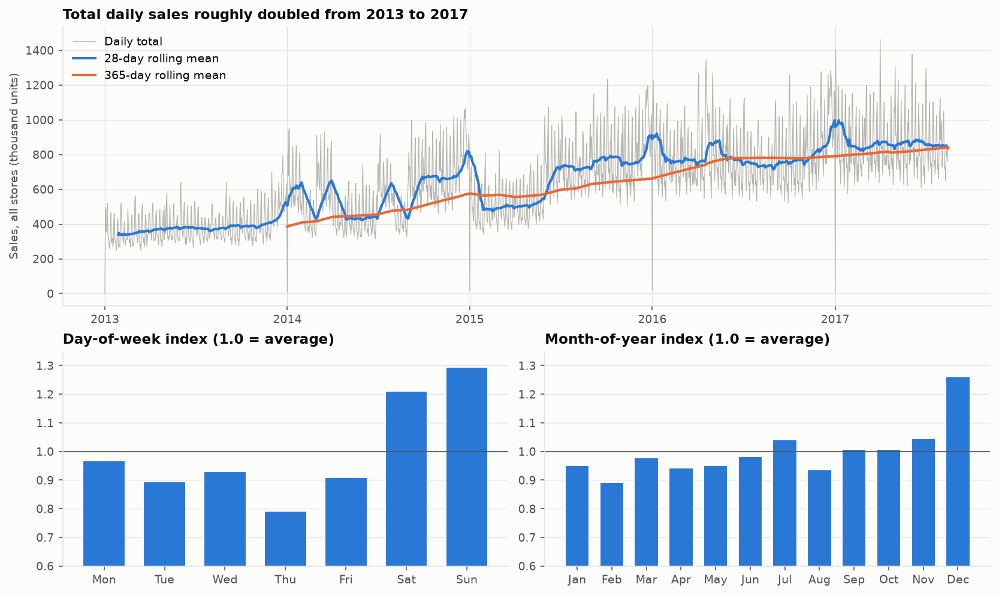
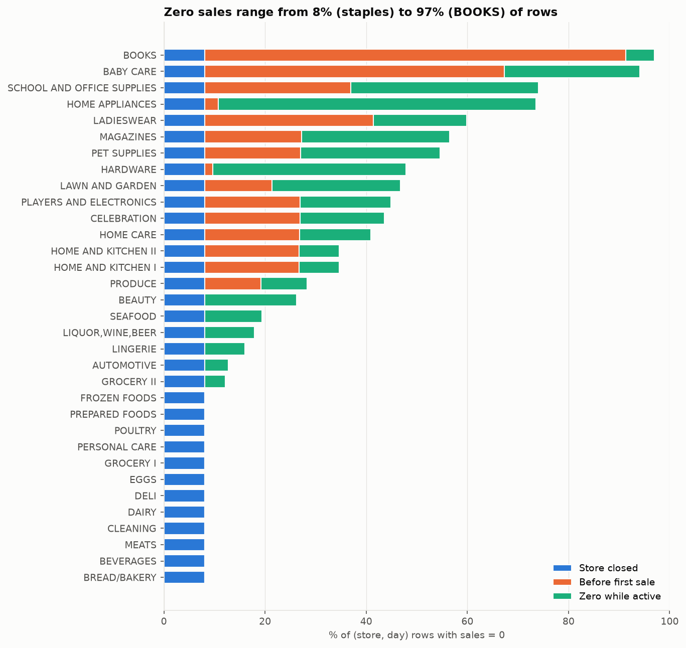
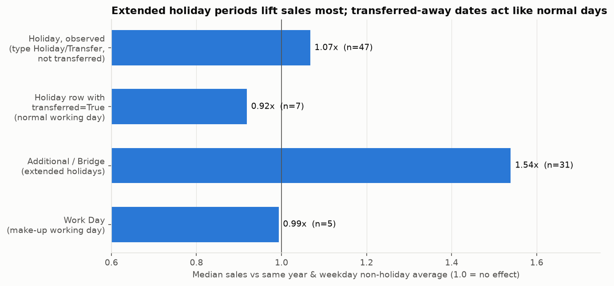
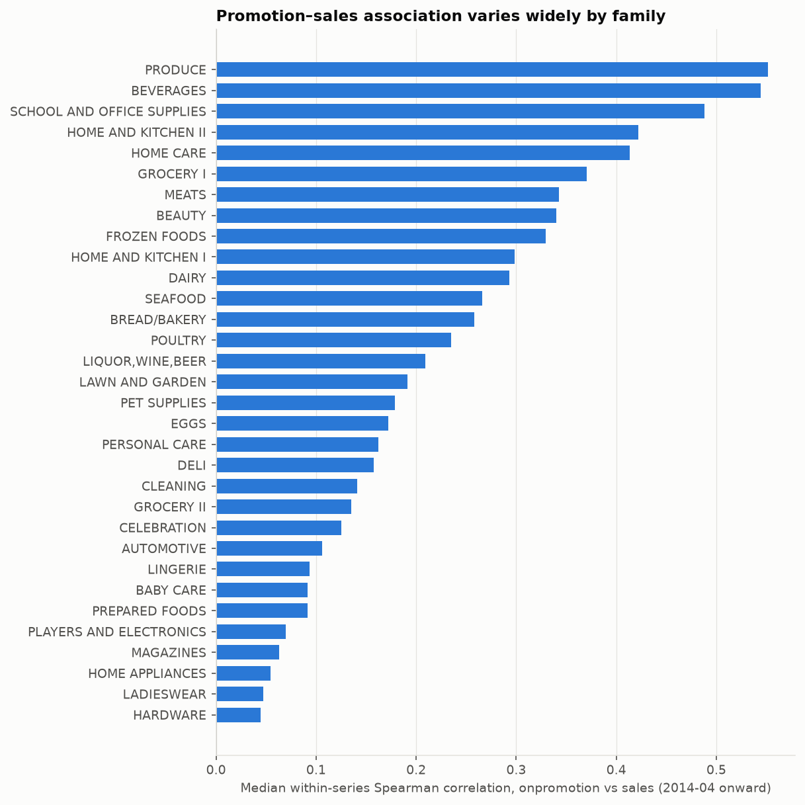
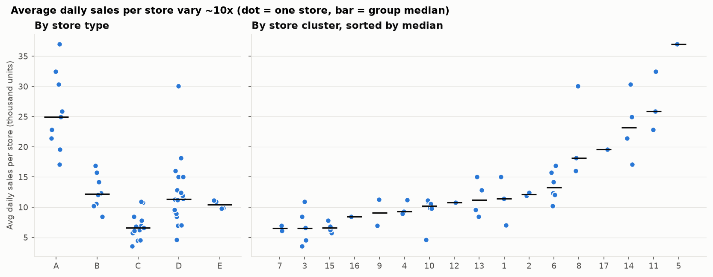
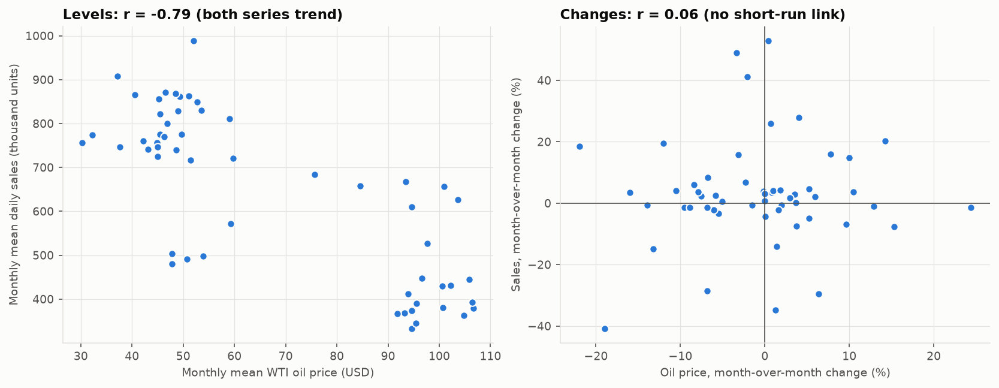
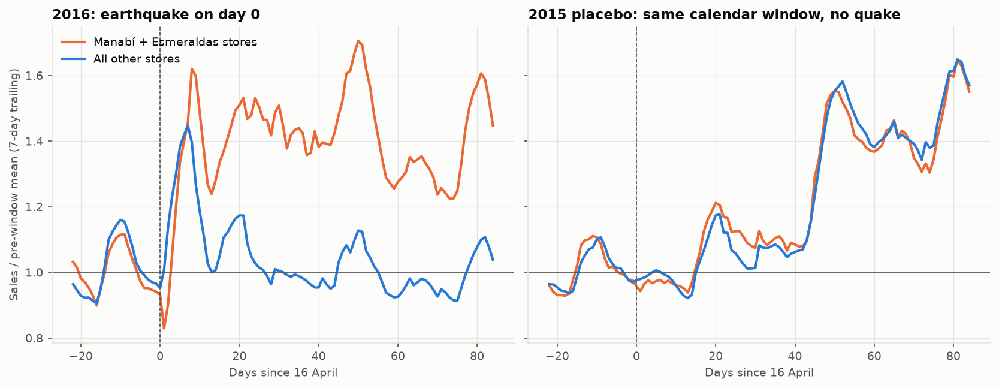
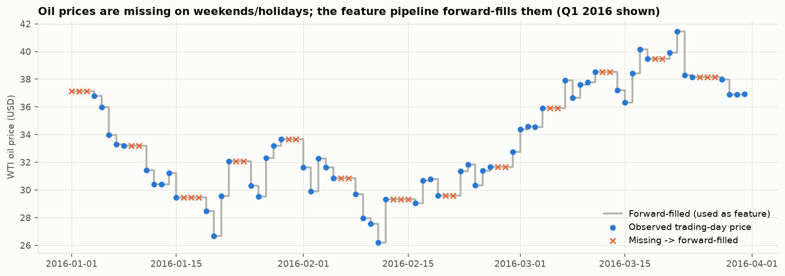

# EDA findings

Summary of [`notebooks/01_eda.ipynb`](../notebooks/01_eda.ipynb), which covers the Kaggle *Store
Sales* data: 3,000,888 rows, 54 stores × 33 product families = 1782 daily series,
2013-01-01..2017-08-15. Every number below is printed by the notebook. Every chart is saved in
[`docs/figures/`](./figures/). To regenerate both:

```bash
uv run jupyter nbconvert --to notebook --execute notebooks/01_eda.ipynb --output 01_eda.ipynb
```

## 1. Trend and seasonality: strong growth, and a weekend-heavy week



Total daily sales grew **2.18×**, from a mean of 385,767 units/day in 2013 to 841,507 over the
last 12 months. Growth came in steps, not smoothly, partly because stores opened and families
started being recorded during the period (see finding 2). Weekly seasonality is strong:
**Sunday is 1.29× and Saturday 1.21× the average day, Thursday only 0.79×.** Yearly
seasonality is mostly a December peak (**1.26×**). Other months sit within about ±10% of
average.

Every **25 December is missing** from `train.csv` (stores closed), and 1 January is almost zero.
Any model that needs a regular daily calendar must fill these dates explicitly.

## 2. Zero-inflation: 31.3% of rows are zero, for three different reasons



**31.3%** of `(store, family, day)` rows have `sales == 0`. That single number mixes three
different situations:

| Kind of zero | Share of all rows | What it means |
|---|---|---|
| Store closed | 8.1% | Every family at the store sold nothing that day: 7,330 store-days, mostly 1 January (264) or before a store's opening date |
| Before first sale | 11.1% | The series hasn't started recording yet. 12 families record nothing *anywhere* at first: 9 until 2014-01-01/02, BABY CARE until 2014-03-01, PRODUCE until 2013-03-16, BOOKS until 2016-10-08 |
| Zero while active | 12.2% | Genuine intermittent demand |

By family, the total zero share runs from **8.1%** (the store-closed floor, and nothing
else) for 12 staple families such as GROCERY I, BEVERAGES and DAIRY, up to **94.1%**
for BABY CARE and **97.0%** for BOOKS. HOME APPLIANCES (62.8% zeros while active) and HARDWARE
(38.2%) are the clearest cases of truly intermittent demand. **53 series are all zero for their
entire history.**

This split drives the model-tier discussion in `docs/model-evaluation.md`:
- Store-closed days and leading not-yet-recorded zeros should be excluded from training.
- All-zero series should just be forecast as zero.
- For genuinely intermittent series, point-forecast metrics are close to meaningless.

## 3. Holidays: extended holiday periods matter far more than the holiday itself



Each holiday day is compared with non-holiday days from the same year and weekday, which
controls for both trend and weekly seasonality. On that basis, observed national holidays
(`type` Holiday/Transfer, `transferred == False`, n=47) show a median lift of only **+7%
(1.07×)**. The raw mean for `type == "Holiday"` days is even slightly *below* normal days
(614,994 vs 628,494 units). The reason is 1 January (median 0.02×, stores closed), which pulls
the average down.

The big effect is on **Additional/Bridge days**, the extended holiday periods (mostly the
Christmas run-up): **1.54×** (n=31).

The `transferred` subtlety matters. A `Holiday` row with `transferred == True` is an ordinary
working day, and sales on those dates show it: **0.92×** (n=7), no holiday lift. Treating
them as holidays would train the model on the wrong signal.

## 4. Promotions: association varies roughly tenfold across families



`onpromotion` is zero everywhere before **2014-04-01**: promotions simply weren't recorded
before then. The analysis therefore uses data from that date onward.

The statistic is the correlation between promotions and sales within each store–family
series (Spearman), taking the median across stores per family. Working within a series avoids
big stores dominating a pooled correlation. The association is strongest for:
- PRODUCE (0.55)
- BEVERAGES (0.54)
- SCHOOL AND OFFICE SUPPLIES (0.49)
- HOME AND KITCHEN II (0.42)

It is almost absent for:
- HARDWARE (0.04)
- LADIESWEAR (0.05)
- HOME APPLIANCES (0.05)
- MAGAZINES (0.06)

BOOKS never has a promotion. These correlations are **not causal**: the retailer chooses what
to promote, and promotions trend upward along with sales.

## 5. Store heterogeneity: a ~10× spread in size, only partly explained by type



Average daily sales per store (on open days) range from **3,545 to 36,979 units (10.4×)**.
Store type separates them only partly:
- Type A has the highest median (24,953).
- Type C has the lowest (6,584).
- Type D spans 4,619..30,067, overlapping every other type.

Cluster medians range from 6,509 to 36,979. The largest store is alone in its cluster (5).
Store-level scale differences are large, which suits global models that learn across series on
normalised targets. It also means aggregate WAPE will be dominated by the big stores.

## 6. Oil price: a strong correlation that is spurious



Oil fell from a 2013 mean of **$98** to a 2016 mean of **$43** while sales doubled. That gives
a strong negative correlation of *levels*: **r = −0.63 daily, −0.79 monthly**. But
month-over-month *changes* are uncorrelated: **r = 0.06** (n = 55 months).

The honest reading is that the level correlation comes from two series trending in opposite
directions over the same period, not from a short-run link. Oil may matter to Ecuador's economy
over longer horizons, but it adds little to a 28-day grocery-sales forecast. It stays in the
feature set (P0.4) so the ML tier can confirm this empirically through feature importance. This
analysis does not assume it is useful.

## 7. Regime shift: the 2016-04-16 earthquake



After the magnitude-7.8 earthquake, sales rose **+40–42% nationwide in the first week**, both in
the three affected stores (Esmeraldas, Manta and El Carmen; stores 43, 53, 54) and in the other
50 stores. For comparison, the same week in 2015 was flat (0.98–1.00×). So the jump is the
quake (relief buying and donations), not the 15 April payday.

The rest of the country returned to baseline within a week (1.00× in days 7–13). **The affected
stores stayed elevated for two months**:

| Window after 16 April | 2016 affected | 2016 rest | 2015 affected | 2015 rest |
|---|---|---|---|---|
| Days 0–6 | 1.40 | 1.42 | 0.98 | 1.00 |
| Days 7–13 | 1.24 | 1.00 | 0.94 | 0.92 |
| Days 14–27 | 1.49 | 1.08 | 1.16 | 1.10 |
| Days 28–55 | 1.46 | 1.01 | 1.28 | 1.27 |

In the 2015 comparison window, the two groups move together; in 2016 they split apart by 40
percentage points or more. This is the worked example for "where the model breaks" in
`docs/model-evaluation.md`. A model trained only on normal patterns would have badly
under-forecast these stores for weeks.

`holidays_events.csv` does flag the aftermath as `Event` rows ("Terremoto Manabi",
2016-04-16..2016-05-16). The event is labelled, but it is national in scope, so it doesn't mark
the regional divergence.

## 8. Missing data in `oil.csv`



`oil.csv` has 1,218 rows over 1,704 calendar days (2013-01-01..2017-08-31). Two kinds of gap:
- **486 calendar days have no row at all**, all of them weekends.
- **43 rows exist but have a NaN price** (weekday market holidays), including the very first
  day, 2013-01-01.

Altogether, **525 of the 1,688 days in the `train.csv` calendar need imputation.** The feature
pipeline (P0.4) forward-fills these gaps, carrying the last trading-day price over non-trading
days. It also needs a backward-fill for the leading 2013-01-01 value, since there is nothing
before it to carry forward.

## Implications for later tasks

- **P0.4 (features):**
  - Forward-fill oil, then backward-fill the first day.
  - Build `is_national_holiday` from observed dates only: exclude `transferred == True` rows and
    include `Transfer` rows.
  - Consider marking Additional/Bridge days separately, given their 1.54× effect.
- **P0.4–P0.6 (data preparation):**
  - Add the missing 25 December dates, with zero sales, for libraries that need a regular daily
    calendar.
  - Exclude store-closed days and leading not-yet-recorded zeros from training.
  - Forecast the 53 all-zero series as zero, outside the model tiers.
- **P0.7 (evaluation):** WAPE across all series is dominated by high-volume stores and families.
  Also report it by volume band.
- **P0.15 (model evaluation):** use finding 7 (the earthquake) and finding 2 (intermittent
  families) as the concrete "where this breaks" cases.
